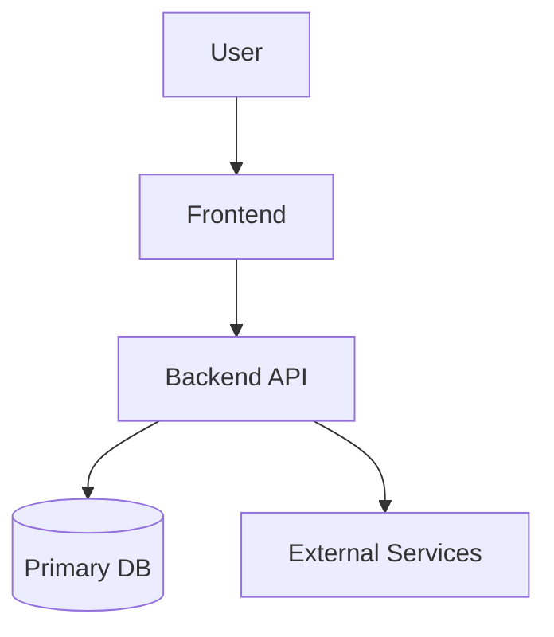

# Architecture

## System Overview
- High-level summary of the solution.

## Diagram

## Components
| Component | Responsibility | Inputs | Outputs | Owner |
|---|---|---|---|---|
|  |  |  |  |  |

## Data Flow
1. 
2. 
3. 

## External Services
| Service | Purpose | Data Shared | Auth Method | Cost/Limit Considerations |
|---|---|---|---|---|
|  |  |  |  |  |

## Non-Functional Requirements
- Performance:
- Reliability:
- Security:
- Observability:

## Risks and Mitigations
| Risk | Impact | Mitigation |
|---|---|---|
|  |  |  |
